# Архитектура проекта `violation_detector`

Документ описывает фактическую архитектуру текущего репозитория: точки входа, режимы выполнения, основные модули, потоки данных, работу ML-инференса, сохранение артефактов, runtime-контракты и расширяемость.

---

<a id="table-of-contents"></a>

## Оглавление

- [1. Назначение системы](#purpose)
- [2. Архитектурная карта верхнего уровня](#high-level-architecture)
- [3. Структура репозитория](#repository-structure)
- [4. Точки входа и сценарии запуска](#entrypoints)
- [5. Режимы выполнения: `legacy` и `centralized`](#runtime-modes)
- [6. Полный поток выполнения `single_source_launcher`](#single-source-flow)
- [7. Полный поток выполнения `multi_camera_launcher`](#multi-camera-flow)
- [8. Последовательность обработки кадра](#frame-pipeline)
- [9. Практический сценарий: одна камера](#single-camera-example)
- [10. Практический сценарий: несколько разных источников](#multi-source-example)
- [11. Каталог основных компонентов](#components)
- [12. ML-архитектура и работа моделей](#ml-architecture)
- [13. Runtime-контракты и состояние системы](#runtime-contracts)
- [14. Работа с файлами, логами и артефактами](#filesystem-and-artifacts)
- [15. Конфигурация и профили runtime](#configuration)
- [16. Наблюдаемость: логи, manifest, статистика, preview](#observability)
- [17. Обработка ошибок и жизненный цикл](#lifecycle-and-failures)
- [18. Расширение системы](#extensibility)
- [19. Текущие архитектурные ограничения и технический долг](#limitations)
- [20. Краткая памятка по тому, как читать проект](#how-to-read)

---

<a id="purpose"></a>

## 1. Назначение системы

Проект предназначен для детекции нарушений по видеопотокам и видеофайлам.

Система умеет:

- обнаруживать перекрытие или деградацию изображения камеры;
- обнаруживать смещение или движение камеры;
- выполнять DMS-анализ кадров;
- фиксировать запрещённые предметы;
- сохранять артефакты нарушений: изображения, видеофрагменты, текстовые отчёты;
- работать в двух режимах:
  - один источник / последовательный пайплайн;
  - несколько источников / централизованный runtime с очередями и воркерами.

Верхнеуровневая цель архитектуры:

- отделить запуск и конфигурацию от обработки кадров;
- отделить получение кадров от инференса;
- переиспользовать одну общую модель YOLO между несколькими детекторами;
- стандартизировать сохранение артефактов и получение runtime-состояния.

---

<a id="high-level-architecture"></a>

## 2. Архитектурная карта верхнего уровня

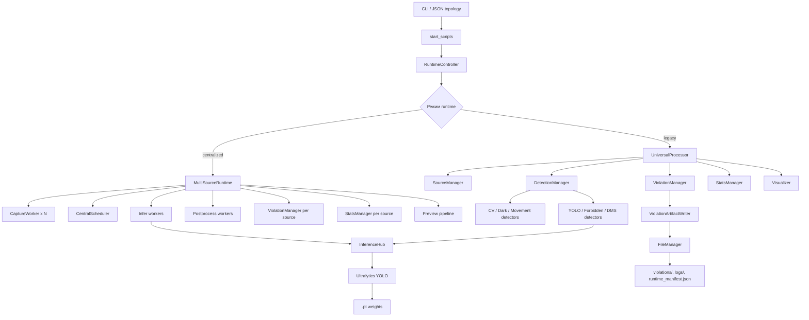

Главная идея:

- `start_scripts/` отвечают за запуск и нормализацию конфигурации;
- `RuntimeController` выбирает движок выполнения;
- `UniversalProcessor` реализует последовательный single-source пайплайн;
- `MultiSourceRuntime` реализует многопоточную централизованную обработку;
- `DetectionManager` инкапсулирует детекторы;
- `InferenceHub` централизует загрузку модели и вызовы `predict`;
- `ViolationManager` и файловый слой сохраняют результаты.

---

<a id="repository-structure"></a>

## 3. Структура репозитория

### 3.1 Верхний уровень

```text
.
├── start_scripts/              # пользовательские точки входа
├── src/
│   ├── detectors/             # алгоритмы детекции
│   ├── inference/             # общий слой инференса и резолв путей моделей
│   ├── processing/            # пайплайн обработки, менеджеры, runtime-движок
│   ├── runtime/               # topology, controller, contracts, scheduler helpers
│   └── utils/                 # конфиг, IO, logging, visualizer, модели
├── tests/                     # unit/integration tests
├── debug/                     # отладочные утилиты
├── requirements.txt           # зависимости runtime + dev + quality gates
├── pyproject.toml             # конфиг ruff/mypy
├── README.md                  # пользовательская документация
└── ARCHITECTURE.md            # этот документ
```

### 3.2 Основные папки `src/`

```text
src/
├── detectors/
│   ├── base_detector.py
│   ├── cv_detector.py
│   ├── dark_area_detector.py
│   ├── movement_detector.py
│   ├── yolo_detector.py
│   ├── forbidden_items_detector.py
│   └── dms_detector.py
│
├── inference/
│   ├── inference_hub.py
│   └── model_path_resolver.py
│
├── processing/
│   ├── universal_processor.py
│   ├── multi_source_runtime.py
│   ├── detection_manager.py
│   ├── violation_manager.py
│   ├── violation_artifact_writer.py
│   ├── source_manager.py
│   ├── capture_worker.py
│   ├── preview_pipeline.py
│   ├── movement_segment_tracker.py
│   └── stats_manager.py
│
├── runtime/
│   ├── controller.py
│   ├── topology.py
│   ├── contracts.py
│   ├── commands.py
│   ├── topology_updates.py
│   ├── scheduler_policy.py
│   ├── state_serializers.py
│   └── snapshot_builders.py
│
└── utils/
    ├── common/
    ├── config/
    ├── io/
    ├── media/
    └── models/
```

---

<a id="entrypoints"></a>

## 4. Точки входа и сценарии запуска

### 4.1 Основные точки входа

Фактические пользовательские точки входа:

- `start_scripts/single_source_launcher.py`
- `start_scripts/multi_camera_launcher.py`

### 4.2 Назначение точек входа

#### `single_source_launcher.py`

Используется для:

- запуска одного источника;
- запуска topology-конфига в `centralized` режиме;
- выбора runtime-профиля;
- настройки логов и runtime manifest;
- создания `RuntimeController`.

#### `multi_camera_launcher.py`

Используется для:

- чтения JSON-конфига с несколькими камерами;
- выбора стратегии запуска:
  - отдельный процесс на камеру;
  - один централизованный процесс на все камеры;
- рестарт-логики дочерних процессов;
- dry-run печати итоговых команд.

### 4.3 Какой скрипт является каноническим

Если нужно понять, как система реально стартует, сначала читать:

1. `start_scripts/single_source_launcher.py`
2. `src/runtime/controller.py`
3. `src/processing/universal_processor.py`
4. `src/processing/multi_source_runtime.py`

---

<a id="runtime-modes"></a>

## 5. Режимы выполнения: `legacy` и `centralized`

### 5.1 `legacy`

Это последовательный single-source пайплайн.

Свойства:

- один источник;
- один основной цикл обработки;
- детекторы вызываются последовательно;
- код проще для локального понимания;
- удобен как базовый runtime.

Ключевой класс:

- `src/processing/universal_processor.py`

### 5.2 `centralized`

Это централизованный runtime для одного или нескольких источников.

Свойства:

- один runtime может обслуживать много источников;
- для каждого источника есть отдельный `CaptureWorker`;
- общий scheduler раздаёт кадры на inference;
- есть infer/postprocess worker-потоки;
- можно управлять источниками в рантайме;
- есть runtime-снимки состояния, статистики и конфигурации.

Ключевой класс:

- `src/processing/multi_source_runtime.py`

### 5.3 Сравнение режимов

| Свойство | `legacy` | `centralized` |
|---|---|---|
| Источники | Обычно 1 | 1..N |
| Захват кадров | В основном цикле | `CaptureWorker` на источник |
| Планирование | Нет отдельного scheduler | Есть scheduler |
| Инференс | Последовательно | Общая infer-очередь + воркеры |
| Постобработка | В том же цикле | Отдельные postprocess workers |
| Управление источниками | Ограничено | Есть команды `stop/resume/update` |
| Снимки состояния | Минимальные | Формализованные runtime contracts |

---

<a id="single-source-flow"></a>

## 6. Полный поток выполнения `single_source_launcher`

### 6.1 Что делает launcher

`single_source_launcher.py` выполняет следующие шаги:

1. Разбирает CLI-аргументы.
2. Выбирает runtime-профиль.
3. Нормализует размеры очередей и воркеров.
4. Вычисляет `output_dir` и `log_file`.
5. Настраивает логирование.
6. При наличии topology JSON:
   - читает конфиг;
   - накладывает runtime profile defaults;
   - строит `RuntimeTopology`.
7. Создаёт `InferenceHub`.
8. Генерирует `runtime_manifest.json`.
9. Создаёт `RuntimeConfig`.
10. Создаёт `RuntimeController`.
11. Запускает runtime и ждёт завершения.

### 6.2 Блок-схема

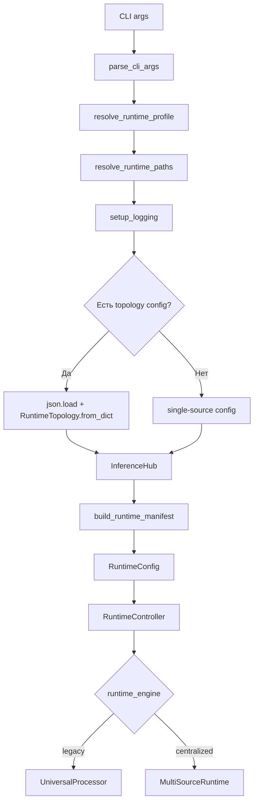

### 6.3 Роль `RuntimeController`

`RuntimeController` является переключателем между двумя реализациями runtime.

Он:

- принимает `RuntimeConfig`;
- решает, какой движок использовать;
- создаёт либо `UniversalProcessor`, либо `MultiSourceRuntime`;
- запускает его в отдельном потоке;
- умеет `start/stop/wait`;
- для `centralized` режима проксирует runtime API и snapshot API.

### 6.4 Блок-схема выполнения для одного источника

Ниже показан типовой путь выполнения, когда пользователь запускает одну камеру или один RTSP/видеоисточник через `single_source_launcher.py`.

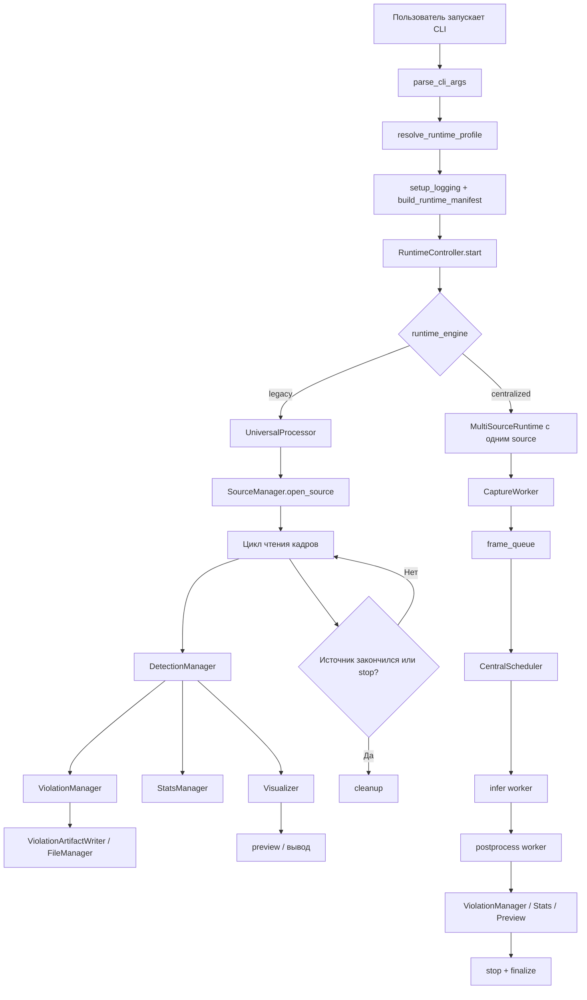

---

<a id="multi-camera-flow"></a>

## 7. Полный поток выполнения `multi_camera_launcher`

### 7.1 Назначение

Этот скрипт не выполняет детекцию сам. Он является внешним оркестратором процессов.

### 7.2 Режимы запуска

#### `mode=legacy`

Для каждой камеры строится отдельная команда запуска `single_source_launcher.py`.

Результат:

- один процесс = одна камера.

#### `mode=centralized`

Строится одна команда `single_source_launcher.py --topology-config ... --runtime-engine centralized`.

Результат:

- один процесс = все источники в общем runtime.

### 7.3 Блок-схема

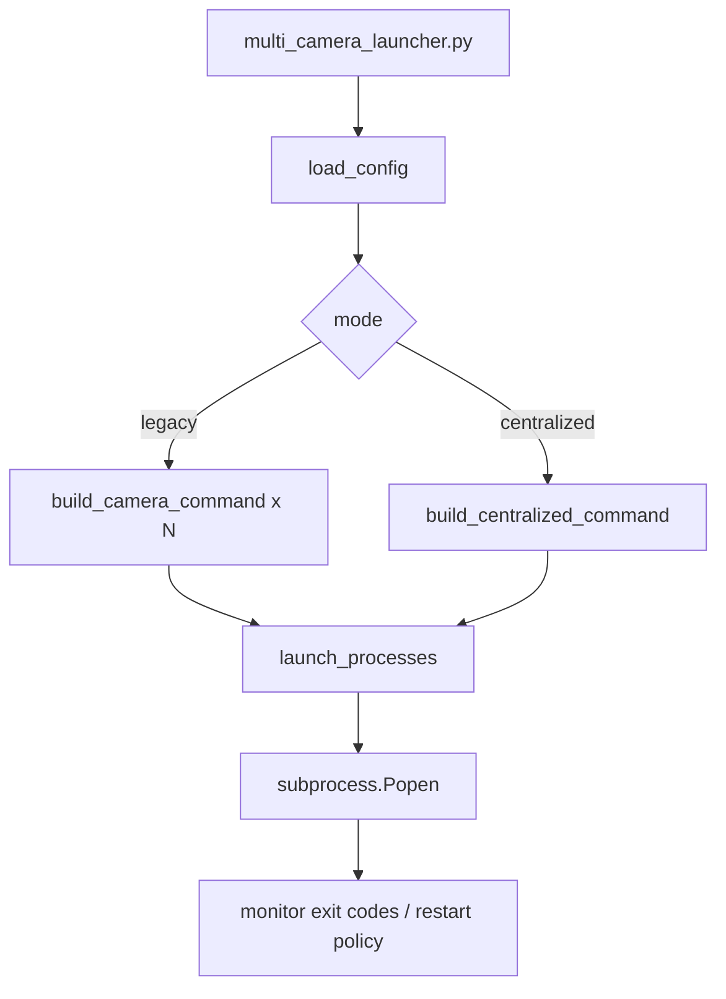

### 7.4 Что важно про этот слой

- это не runtime-пайплайн, а процессный supervisor;
- он умеет перезапускать дочерние процессы;
- логирует команды в безопасном виде через редактирование RTSP URL;
- не знает внутренних деталей детекции.

### 7.5 Как выглядит запуск нескольких разных источников

Если в topology/JSON указаны разные источники, например:

- `camera_id=0`;
- `camera_id=4`;
- `input=rtsp://...`;
- `input=/data/archive/night_shift.mp4`;

то `multi_camera_launcher.py` работает как внешний оркестратор, а дальше:

- в `legacy` режиме создаёт отдельный процесс на каждый источник;
- в `centralized` режиме создаёт один процесс и передаёт все источники в `RuntimeTopology`.

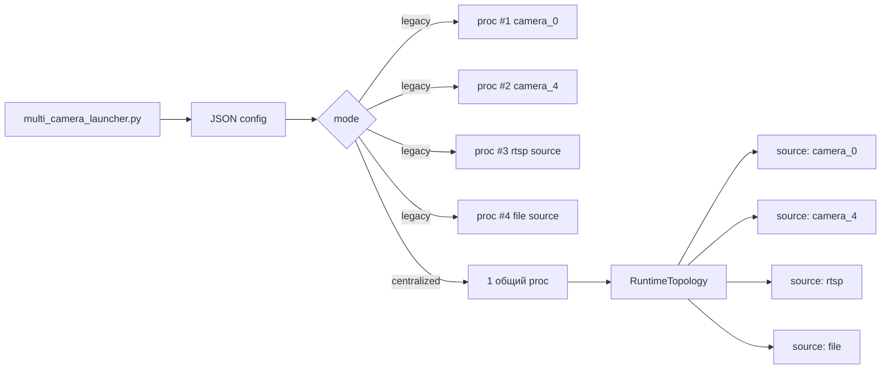

---

<a id="frame-pipeline"></a>

## 8. Последовательность обработки кадра

### 8.1 Единая доменная логика

Независимо от режима runtime, доменная логика обработки кадра концептуально одинакова:

1. получить кадр и timestamp;
2. прогнать детекторы;
3. обновить статистику;
4. определить, есть ли нарушение;
5. при необходимости сохранить артефакты;
6. собрать данные для preview/UI;
7. перейти к следующему кадру.

### 8.2 Логический пайплайн кадра

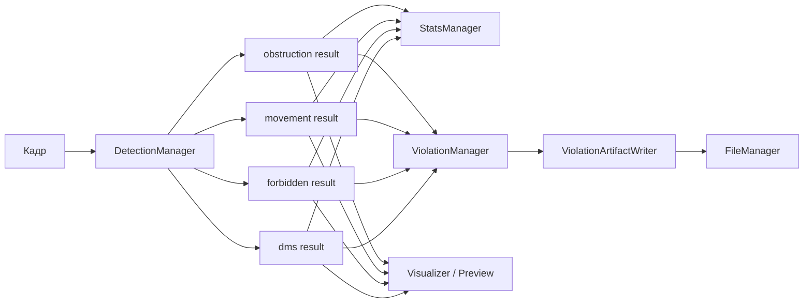

### 8.3 В `legacy` режиме

Последовательность реализована внутри `UniversalProcessor.process_frame(...)`.

Порядок:

1. `detect_obstruction`
2. `detect_movement`
3. `detect_forbidden`
4. `detect_dms`
5. `_update_stats`
6. `ViolationManager.process_*`
7. `Visualizer.draw`

### 8.4 В `centralized` режиме

Пайплайн расщеплён на стадии:

- `CaptureWorker` читает кадры;
- scheduler выбирает следующий источник;
- inference stage делает shared YOLO predict;
- postprocess stage запускает детекторную постобработку;
- violation stage сохраняет артефакты;
- preview stage рисует кадры и/или вызывает callback.

Это повышает масштабируемость, но усложняет понимание жизненного цикла.

### 8.5 Подробная блок-схема `legacy` для одного кадра

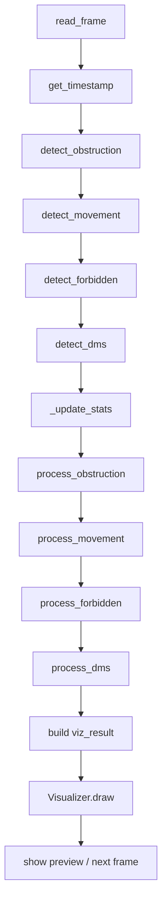

### 8.6 Подробная блок-схема `centralized` для одного кадра

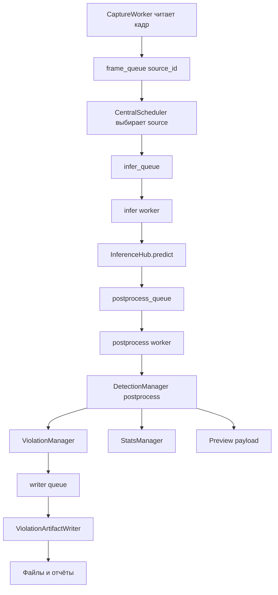

---

<a id="single-camera-example"></a>

## 9. Практический сценарий: одна камера

### 9.1 Пример команды

```bash
python start_scripts/single_source_launcher.py \
  --camera-id 0 \
  --runtime-engine legacy \
  --detectors all \
  --output violations
```

### 9.2 Что происходит по шагам

1. CLI разбирает `--camera-id 0`.
2. Выбирается runtime profile и вычисляются эффективные параметры.
3. Создаются директории логов и выходных артефактов.
4. Генерируется `runtime_manifest.json`.
5. `RuntimeController` создаёт `UniversalProcessor`.
6. `SourceManager` открывает локальную камеру через OpenCV backend.
7. Начинается цикл:
   - читается кадр;
   - вычисляется timestamp;
   - вызываются детекторы;
   - обновляется статистика;
   - при нарушении ставится задача записи артефактов;
   - строится preview-кадр.
8. При остановке или потере источника выполняется `cleanup`.

### 9.3 Схема: одна камера от запуска до сохранения нарушения

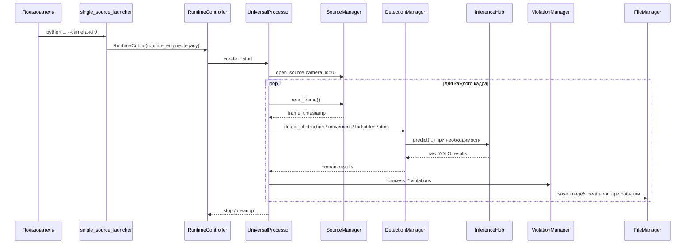

### 9.4 Что важно понимать в этом сценарии

- для одной камеры проще всего читать систему именно через `legacy` режим;
- `UniversalProcessor` является фактическим центром orchestration;
- даже в single-source сценарии сохранение нарушений отделено от логики детекции;
- YOLO нужен не для всех детекторов, но вызывается через единый `InferenceHub`.

---

<a id="multi-source-example"></a>

## 10. Практический сценарий: несколько разных источников

### 10.1 Пример состава источников

Допустим, topology содержит:

- локальную камеру `camera_0`;
- локальную камеру `camera_4`;
- RTSP-поток из сети;
- архивный MP4-файл.

### 10.2 Что происходит концептуально

1. Launcher читает topology JSON.
2. Создаётся `RuntimeTopology` со списком `SourceConfig`.
3. `RuntimeController` создаёт `MultiSourceRuntime`.
4. Для каждого источника создаётся свой `SourceContext`.
5. Для каждого источника стартует свой `CaptureWorker`.
6. Каждый `CaptureWorker` складывает кадры в свою очередь.
7. Scheduler выбирает, какой источник обслужить следующим.
8. Infer worker делает общий инференс.
9. Postprocess worker собирает детекторные результаты.
10. Для каждого источника отдельно обновляются:
    - статистика;
    - violation state;
    - preview;
    - health state.

### 10.3 Схема: несколько источников в одном centralized runtime

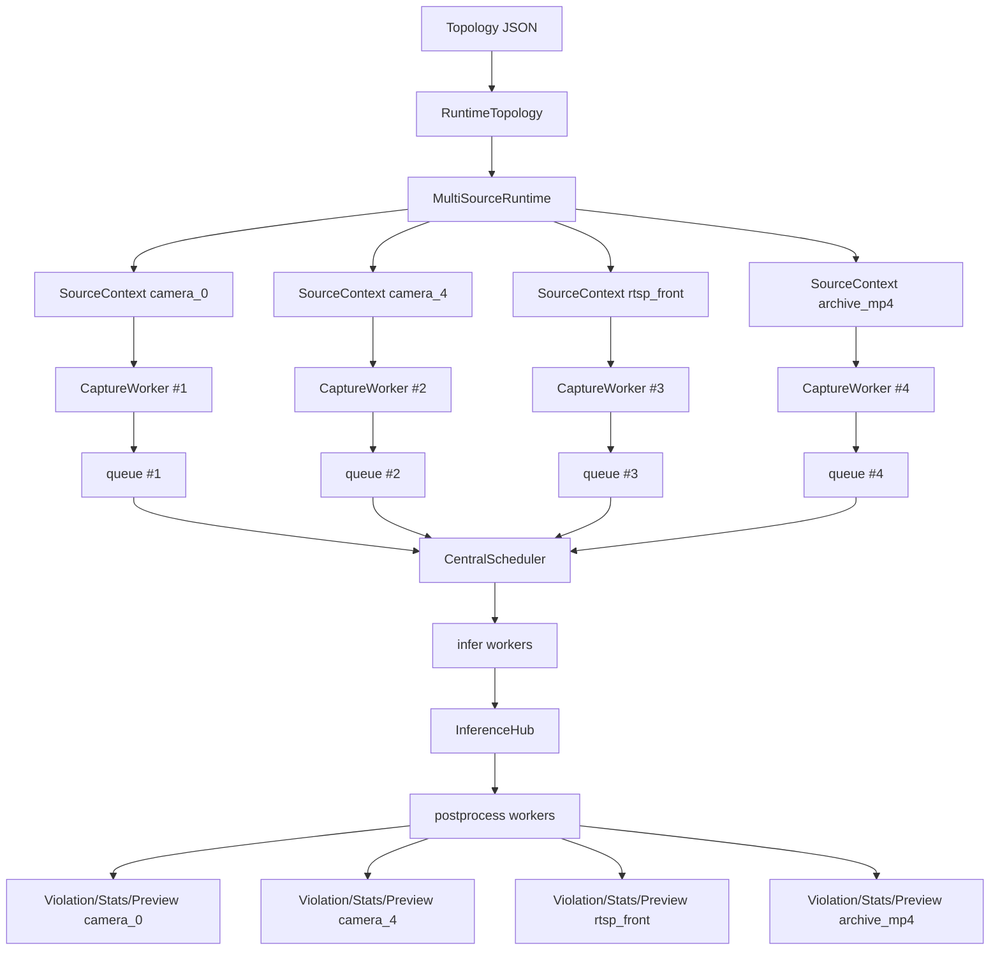

### 10.4 Схема: кто за что отвечает для разных типов источников

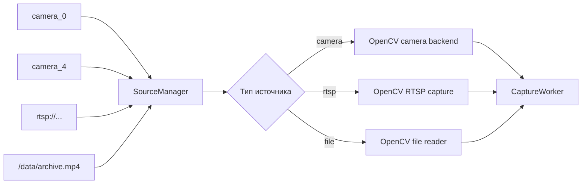

### 10.5 Почему этот сценарий сложнее

- у каждого источника свой жизненный цикл;
- кадры от разных источников конкурируют за infer capacity;
- статистика и ошибки должны вестись раздельно по `source_id`;
- preview и артефакты тоже разделяются по источникам;
- для file source и live source поведение по завершению разное:
  - файл может завершиться штатно;
  - RTSP/камера могут переподключаться.

---

<a id="components"></a>

## 11. Каталог основных компонентов

### 9.1 `start_scripts/`

#### `single_source_launcher.py`

Роль:

- CLI;
- bootstrap окружения;
- загрузка topology;
- создание runtime manifest;
- запуск `RuntimeController`.

#### `multi_camera_launcher.py`

Роль:

- чтение JSON-конфига нескольких камер;
- генерация дочерних команд;
- перезапуск процессов;
- dry-run.

### 9.2 `src/runtime/`

#### `controller.py`

Внешний фасад runtime.

Отвечает за:

- выбор `legacy` vs `centralized`;
- lifecycle runtime;
- единый API запуска/остановки;
- получение состояния/статистики/конфигурации.

#### `topology.py`

Описывает:

- `SourceConfig`;
- `SchedulerConfig`;
- `RuntimeTopology`;
- `RuntimeProfile`;
- выбор профиля runtime по ресурсам машины.

#### `contracts.py`

Формализует стабильные dataclass-контракты для:

- состояния runtime;
- статистики runtime;
- состояния источника;
- preview payload;
- команд управления.

#### `commands.py` и `topology_updates.py`

Отвечают за:

- обработку runtime-команд;
- горячее изменение части topology;
- `stop/resume/reset/update`.

### 9.3 `src/processing/`

#### `universal_processor.py`

Single-source обработчик.

Содержит:

- инициализацию менеджеров;
- основной цикл обработки;
- обработку кадра;
- визуализацию;
- синхронизацию проигрывания файла;
- финальную очистку.

#### `multi_source_runtime.py`

Самый крупный и самый сложный компонент проекта.

Содержит:

- контекст источников;
- создание `CaptureWorker`;
- scheduler loop;
- inference loop;
- postprocess loop;
- preview loop;
- runtime-команды;
- runtime-снимки;
- завершение и очистку.

#### `detection_manager.py`

Точка координации детекторов.

Отвечает за:

- ленивое создание экземпляров детекторов;
- включение/отключение runtime-детекторов;
- detector schedule;
- shared YOLO infer params;
- вызов конкретных детекторов.

#### `violation_manager.py`

Доменный менеджер нарушений.

Отвечает за:

- принятие решения о сохранении;
- антидублирование;
- cooldown-логику;
- async writer queue;
- сбор unified violation metadata;
- вызов `ViolationArtifactWriter`.

#### `source_manager.py`

Абстракция источника видео.

Поддерживает:

- локальную камеру;
- RTSP/RTSPS;
- видеофайл.

#### `capture_worker.py`

Поток захвата кадров для `centralized` режима.

Отвечает за:

- открытие источника;
- чтение кадров;
- переподключение для reconnectable sources;
- заполнение source queue;
- сбор метрик захвата.

#### `stats_manager.py`

Хранит:

- счётчики нарушений;
- FPS;
- длительности;
- summary-вывод.

#### `violation_artifact_writer.py`

Низкоуровневая запись:

- изображений;
- видео;
- текстовых отчётов.

### 9.4 `src/detectors/`

#### `cv_detector.py`

Проверка качества кадра по метрикам изображения.

#### `dark_area_detector.py`

Поиск тёмных областей.

#### `movement_detector.py`

Детекция смещения камеры.

#### `yolo_detector.py`

YOLO-детектор крупных объектов для сценария obstruction.

#### `forbidden_items_detector.py`

Проверка запрещённых предметов на базе общей YOLO-модели.

#### `dms_detector.py`

DMS-логика на базе общей YOLO-модели и жёстко ожидаемого набора class-id.

### 9.5 `src/inference/`

#### `inference_hub.py`

Центральный слой инференса.

Отвечает за:

- загрузку моделей;
- кэширование моделей;
- кэширование результатов predict;
- потоковую синхронизацию доступа к моделям;
- унификацию вызовов `YOLO.predict`.

#### `model_path_resolver.py`

Безопасно резолвит путь к модели:

- по умолчанию только внутри `src/utils/models`;
- не даёт выйти за разрешённый model root;
- проверяет существование файла.

### 9.6 `src/utils/`

#### `utils/common/`

- настройка логирования;
- привязка `source_id` к log context;
- вспомогательные функции.

#### `utils/io/`

- редактирование чувствительных строк источников;
- запись runtime manifest;
- файловый менеджер.

#### `utils/media/visualizer.py`

Рисует:

- status overlays;
- bbox;
- stats panels;
- FPS;
- индикаторы нарушений.

#### `utils/config/`

Содержит:

- detector aliases;
- detector schedule defaults;
- visualizer config;
- индикаторы;
- пример multi-camera JSON.

#### `utils/models/`

Каноническая директория production-весов.

---

<a id="ml-architecture"></a>

## 12. ML-архитектура и работа моделей

### 10.1 Общая идея

Проект использует общую YOLO-модель как shared backbone для нескольких задач.

Переиспользование модели выглядит так:

- `YOLODetector` использует общую модель для obstruction;
- `ForbiddenItemsDetector` использует ту же модель;
- `DMSDetector` использует ту же модель, но фильтрует специфические классы.

### 10.2 Слой `InferenceHub`

`InferenceHub` нужен для того, чтобы:

- не грузить одну и ту же модель много раз;
- кэшировать результаты на последние кадры;
- синхронизировать доступ к модели между потоками;
- иметь единый API для `predict`.

### 10.3 Как грузится модель

Путь до модели проходит через:

1. `resolve_model_path(...)`
2. проверку, что путь находится внутри допустимой директории;
3. `YOLO(resolved_weights_path)` внутри `InferenceHub`.

### 10.4 Shared infer в `centralized` режиме

В `DetectionManager` строятся shared params для YOLO:

- `model_key`
- `weights_path`
- `conf`
- `iou`
- `max_det`
- `imgsz`

Если несколько детекторов используют одну и ту же модель, runtime старается выполнить общий predict один раз и затем раздать результат постобработчикам.

### 10.5 Логика конкретных детекторов

#### `YOLODetector`

Использует результат YOLO для поиска крупных объектов, которые перекрывают значительную часть кадра.

#### `ForbiddenItemsDetector`

Работает так:

1. получает все bbox из shared YOLO;
2. фильтрует их по имени класса;
3. считает duration и cooldown;
4. формирует violation_info.

#### `DMSDetector`

Работает так:

1. ограничивает набор допустимых class-id;
2. получает detections;
3. отслеживает phone/cigarette;
4. ведёт состояние глаз и ремня;
5. формирует список `violations`.

### 10.6 Архитектурный риск ML-части

Система предполагает фиксированный label-space модели.

Особенно это важно для `DMSDetector`, где class-id заданы жёстко:

- open eye;
- closed eye;
- cigarette;
- seatbelt;
- phone.

Следствие:

- замена весов без проверки class map может сломать DMS без явной ошибки;
- один shared `.pt` становится точкой сцепления нескольких задач.

---

<a id="runtime-contracts"></a>

## 13. Runtime-контракты и состояние системы

### 11.1 Зачем нужен слой contracts

`src/runtime/contracts.py` формализует структуру данных, которую runtime возвращает наружу.

Это нужно для:

- UI;
- интеграций;
- тестов;
- устойчивого snapshot API.

### 11.2 Основные контракты

- `SourceCommandResult`
- `SourceStateSnapshot`
- `RuntimeStateSnapshot`
- `SourceStatsSnapshot`
- `RuntimeStatsSnapshot`
- `PreviewFramePayload`

### 11.3 Что можно получить от runtime

В `centralized` режиме доступны:

- текущее состояние runtime;
- состояние каждого источника;
- runtime-статистика;
- конфигурационный snapshot;
- список UI-возможностей;
- per-source visual config;
- per-source detectors;
- hot topology updates.

### 11.4 Управляющие команды

Поддерживаются команды:

- `set_source_detectors`
- `get_source_detectors`
- `stop_source`
- `resume_source`
- `reset_movement_reference`
- `set_source_visual_config`
- `get_source_visual_config`
- `apply_topology_updates`

### 11.5 Где живёт state

Главный state `centralized` runtime сосредоточен в `MultiSourceRuntime`:

- source contexts;
- очереди;
- треды;
- scheduler state;
- статистика;
- ошибки;
- preview state.

---

<a id="filesystem-and-artifacts"></a>

## 14. Работа с файлами, логами и артефактами

### 12.1 Основные файловые сущности

```text
violations/
├── logs/
│   ├── camera_0.log
│   └── camera_4.log
├── runtime_manifest.json
├── obstruction/
├── movement/
├── forbidden_items/
└── dms/
```

Точная структура зависит от режима запуска и source id.

### 12.2 Кто за что отвечает

#### `FileManager`

Отвечает за:

- генерацию имён файлов;
- создание нужных директорий;
- сохранение текстовых отчётов.

#### `ViolationArtifactWriter`

Отвечает за:

- `cv2.imwrite(...)`;
- запись movement-видео через `cv2.VideoWriter`;
- делегирование отчётов в `FileManager`.

#### `ViolationManager`

Отвечает за:

- момент сохранения;
- состав violation metadata;
- async writer queue;
- подавление дублей.

### 12.3 Какие артефакты создаются

- JPG для obstruction;
- MP4 + TXT для movement;
- JPG + TXT для forbidden;
- JPG + TXT для DMS;
- `runtime_manifest.json`;
- лог-файлы запуска.

### 12.4 Runtime manifest

`runtime_manifest.json` фиксирует:

- версию Python;
- platform;
- runtime engine;
- runtime profile;
- device;
- queue sizes;
- worker counts;
- output/save/log paths;
- shared model path;
- package versions;
- topology summary.

Назначение:

- воспроизводимость runtime;
- диагностика;
- аудит реального запуска.

---

<a id="configuration"></a>

## 15. Конфигурация и профили runtime

### 13.1 Источники конфигурации

Система получает конфигурацию из:

- CLI-аргументов;
- topology JSON;
- runtime profile defaults;
- detector schedule defaults;
- internal defaults классов.

### 13.2 Runtime profile

`RuntimeProfile` задаёт:

- `imgsz`
- `source_queue_size`
- `infer_queue_size`
- `infer_workers`
- `postprocess_workers`
- `dispatch_sleep_sec`

Профили:

- `laptop`
- `balanced`
- `server`
- `auto`

### 13.3 Topology

`RuntimeTopology` описывает:

- список источников `sources`;
- конфиг scheduler;
- число infer workers;
- число postprocess workers;
- флаг `use_centralized_runtime`.

### 13.4 Пример цепочки разрешения конфигурации

```text
CLI / JSON
  -> runtime profile
  -> topology patching
  -> RuntimeTopology / RuntimeConfig
  -> RuntimeController
  -> фактический runtime
```

### 13.5 Редактирование источников и безопасное логирование

Для логов и печати команд используется `source_redaction.py`.

Он:

- маскирует логины/пароли в RTSP URL;
- сокращает абсолютные пути;
- форматирует безопасную строку команды.

---

<a id="observability"></a>

## 16. Наблюдаемость: логи, manifest, статистика, preview

### 14.1 Логи

Логирование настраивается через `utils/common/utils.py`.

Поддерживаются:

- console logging;
- единый file logging;
- split logging по `source_id`.

`bind_log_source(...)` позволяет привязать записи к конкретному источнику.

### 14.2 Статистика

`StatsManager` накапливает:

- количество кадров;
- FPS;
- количества нарушений;
- длительности событий;
- DMS-статус;
- summary-таблицу.

### 14.3 Preview

Preview-контур в `centralized` режиме вынесен в `preview_pipeline.py`.

Он умеет:

- строить preview payload;
- переключать активный источник;
- закрывать preview окна;
- вызывать внешний callback.

### 14.4 Состояние и health

Runtime может вернуть:

- текущее состояние источника;
- глубины очередей;
- объём дропов;
- наличие последней ошибки;
- `health_status`.

---

<a id="lifecycle-and-failures"></a>

## 17. Обработка ошибок и жизненный цикл

### 15.1 Открытие источников

`SourceManager` различает:

- camera;
- rtsp/rtsps;
- file.

Для камер:

- выбирает backend OpenCV по ОС;
- настраивает разрешение и FPS.

Для RTSP:

- открывает `cv2.VideoCapture(url)`;
- логирует адрес в редактированном виде.

Для файлов:

- читает FPS, размер кадра, `total_frames`, `duration_sec`.

### 15.2 Жизненный цикл `legacy`

```text
open source
  -> process loop
  -> detect
  -> visualize
  -> save artifacts
  -> cleanup
```

### 15.3 Жизненный цикл `centralized`

```text
build source contexts
  -> start capture workers
  -> scheduler loop
  -> infer loop
  -> postprocess loop
  -> preview loop
  -> stop/join/finalize
```

### 15.4 Обработка ошибок

Ошибки локализуются в нескольких слоях:

- launcher-level;
- source open/read;
- detector-level;
- inference-level;
- artifact writer;
- runtime controller;
- capture worker / scheduler / postprocess loops.

Подход проекта:

- чаще всего логировать ошибку и продолжать работу;
- падать только при фатальном сбое запуска или некорректной конфигурации.

### 15.5 Переподключение

В `centralized` режиме `CaptureWorker` умеет переподключать reconnectable sources.

Это особенно важно для:

- камер;
- RTSP-потоков.

---

<a id="extensibility"></a>

## 18. Расширение системы

### 16.1 Как добавить новый детектор

Минимальная цепочка:

1. Создать класс в `src/detectors/`.
2. Подключить его в `DetectionManager`.
3. Добавить alias в `utils/config/detector_aliases.py`.
4. При необходимости добавить schedule default.
5. Добавить визуализацию и статистику.
6. Добавить тесты.

### 16.2 Как добавить новый runtime-параметр

Обычно требуется пройти цепочку:

1. CLI / JSON topology;
2. `RuntimeConfig` или `RuntimeTopology`;
3. `RuntimeController`;
4. `UniversalProcessor` и/или `MultiSourceRuntime`;
5. `runtime_manifest`;
6. тесты.

### 16.3 Как добавить новый тип артефакта

Нужно затронуть:

1. `ViolationManager`
2. `ViolationArtifactWriter`
3. `FileManager`
4. tests

### 16.4 Как добавить новый источник данных

Точка расширения:

- `SourceManager`
- при необходимости `CaptureWorker`

---

<a id="limitations"></a>

## 19. Текущие архитектурные ограничения и технический долг

### 17.1 Два параллельных доменных контура

Проект поддерживает сразу:

- `UniversalProcessor`
- `MultiSourceRuntime`

Из-за этого часть доменной логики дублируется:

- индикаторы;
- визуализационный payload;
- orchestration поведения детекторов.

### 17.2 Очень крупные модули

Наиболее тяжёлые для понимания файлы:

- `src/processing/multi_source_runtime.py`
- `src/processing/violation_manager.py`
- `src/processing/detection_manager.py`
- `src/utils/media/visualizer.py`

### 17.3 Shared YOLO как точка сцепления задач

Одна модель используется для нескольких доменных задач.

Это удобно по производительности, но создаёт сильную связанность:

- замена весов меняет сразу несколько подсистем;
- DMS особенно зависит от фиксированного набора class-id.

### 17.4 Разъезд документации и кода

`README.md` описывает устаревший путь запуска через `main.py`.

Архитектурно это важно помнить:

- канонический запуск уже живёт в `start_scripts/`.

### 17.5 Нет выраженного packaging слоя

Сейчас bootstrap местами зависит от:

- `sys.path` injection;
- относительного расположения файлов.

Это усложняет:

- установку как пакета;
- переносимость;
- внешние интеграции.

---

<a id="how-to-read"></a>

## 20. Краткая памятка по тому, как читать проект

Если нужно быстро понять проект с нуля, рекомендованный порядок чтения такой:

1. `ARCHITECTURE.md`
2. `start_scripts/single_source_launcher.py`
3. `src/runtime/controller.py`
4. `src/runtime/topology.py`
5. `src/processing/universal_processor.py`
6. `src/processing/multi_source_runtime.py`
7. `src/processing/detection_manager.py`
8. `src/processing/violation_manager.py`
9. `src/inference/inference_hub.py`
10. `src/detectors/`
11. `src/utils/io/` и `src/utils/media/visualizer.py`
12. `tests/`

Если задача про:

- запуск и параметры: читать `start_scripts/` и `runtime/topology.py`;
- источники видео: читать `source_manager.py` и `capture_worker.py`;
- инференс и модели: читать `inference_hub.py`, `model_path_resolver.py`, `detectors/`;
- артефакты и сохранение: читать `violation_manager.py`, `violation_artifact_writer.py`, `file_manager.py`;
- UI/runtime API: читать `runtime/contracts.py`, `runtime/commands.py`, `runtime/topology_updates.py`.

---

## Итог

Архитектурно проект можно представить так:

- слой запуска и конфигурации;
- слой runtime-оркестрации;
- слой обработки кадров;
- слой ML-инференса и детекторов;
- слой сохранения артефактов;
- слой наблюдаемости и runtime-снимков.

Ключевой архитектурный центр проекта сегодня:

- `RuntimeController`
- `UniversalProcessor`
- `MultiSourceRuntime`
- `DetectionManager`
- `InferenceHub`
- `ViolationManager`

Именно через эти компоненты проходит почти весь жизненный цикл системы: от CLI и topology-конфига до детекции нарушений, логов, preview и сохранения артефактов.
